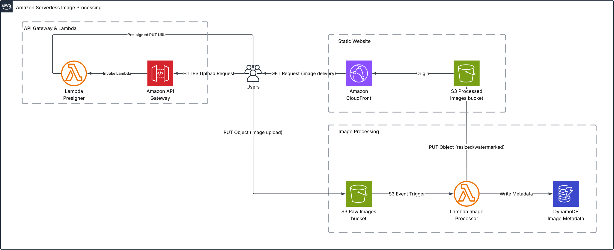

# Manara SAA Project

My Project for the course: AWS 2: Becoming a Solution Architect

## Serverless Image Processing with S3 and Lambda

- Architecture: Serverless

- Description:

  Create a serverless image processing application where users upload images to an S3 bucket, triggering an AWS Lambda function that processes and resizes the images before storing them in another S3 bucket.

- Key AWS Services Used:
  - Amazon S3: Stores original and processed images.
  - AWS Lambda: Gives user a signed URL for uploads and executes image processing (resize, watermarking).
  - Amazon API Gateway: Expose an API for uploads.
  - Amazon DynamoDB: Store metadata about uploaded images.
  - AWS CloudFront: Pulls content from processed bucket

